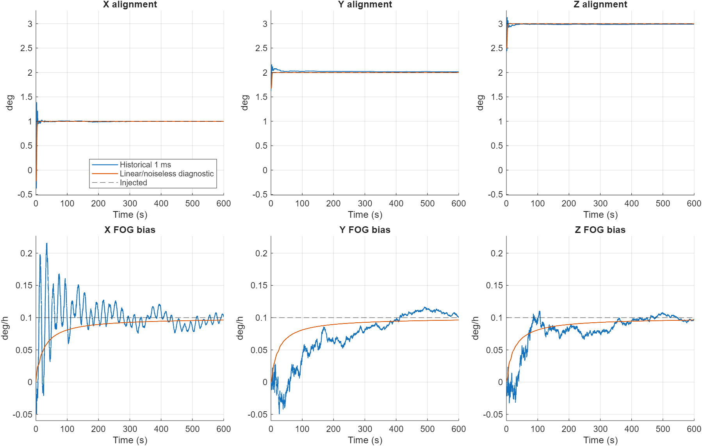

# Convergence comparison

Zhang Table 2 (p.11) reports 74.60 s for level 2, biases
[0.0954448,0.0996846,0.1014449] deg/h and angles [1,2,3] deg at the table's
precision. Section 4 does not supply a tolerance/dwell rule sufficient to
reproduce that time. The 0.01 deg/h fluctuation criterion on p.13 concerns
the field test and is not transferred here. Figure 8 uses different time
scales for angles (0.5 min) and biases (5 min); Figure 9 varies data rate.

The [fixed review protocol](CONVERGENCE_PROTOCOL.md) uses all three axes,
0.05 deg / 0.02 deg/h error tolerances and 30 s uninterrupted dwell. This
is a descriptive metric, not a claim to reproduce Table 2's criterion.
Results below are seconds: interval start / confirmation / final sustained start.

| Sway case | Alignment | Bias (also joint in these cases) |
|---|---|---|
| Historical, exact rotation, seed 5606 | 26.21 / 56.21 / 26.21 | 333.21 / 363.21 / 506.01 |
| Exact rotation, noise removed | 5.61 / 35.61 / 5.61 | 228.21 / 258.21 / 325.21 |
| Linear rotation, noise removed | 4.81 / 34.81 / 4.81 | 94.81 / 124.81 / 94.81 |
| Linear rotation, original noise | 7.01 / 37.01 / 7.01 | 332.21 / 362.21 / 332.21 |

Constant speed never meets either group's dwell condition before 599.81 s;
its rank-3 identification problem is not solved by waiting longer.
For historical sway, the last measurement available by 74.60 s is at 74.41 s.
Its angle errors are [0.002241,0.028737,-0.015421] deg and bias errors
[0.067842,-0.082196,-0.031234] deg/h. Alignment and bias do not converge at
the same rate. Machine-readable values are in `review/results/convergence.json`.

## What the isolated experiments establish

Removing noise while holding R fixed isolates the realized FOG disturbance,
not an optimally retuned noiseless filter. Replacing only the finite rotation
then removes most persistent alignment offset: final noiseless errors change
from [-0.000746,0.014919,-0.013033] to approximately
[-0.000035,-0.000005,-0.000004] deg. Bias remains prior-shrunk to 0.096213
deg/h at 600 s in both noiseless cases. At intermediate times, the oscillatory
finite-rotation discrepancy also delays the bias dwell condition.

Seeds 5607–5611 leave all parameters fixed. Bias confirmation times are,
respectively: not reached, 458.41 s, not reached, 558.61 s, 428.01 s.
Some qualifying intervals later end. Five additional seeds diagnose realization
sensitivity; they are not a statistical performance or coverage study.

At 1 ms, only 6000 of 60001 FOG samples contribute (about 10%): two samples
per atomic shot, weights 0.9/0.1. The noise-equivalent count is only 1.2195
independent samples per update and R=2.775403158e-11 (rad/s)^2. For an isolated
bias coordinate, R/P0=118.08 updates (23.616 s); after about 373 updates the
zero-mean prior still causes substantial shrinkage. The coupled six-state
case is evaluated above rather than inferred from this scalar approximation.
A full 20-sample mean would reduce white variance by a factor 16.4 relative
to these weights, but represents a different time-window measurement and
cannot simply replace FOG synchronization against an instantaneous CAIG datum.

At 20 ms five FOG nodes across 40 ms have weights [1/8,1/4,1/4,1/4,1/8],
variance factor 0.21875 versus 0.82. The new window and noise averaging change
the control curves along with T. This is not a clean experimental isolation
of atomic sensitivity. With ideal probability readout, valid phase division
by K recovers the rate numerically at either T; no atomic shot-noise penalty
at 1 ms is present. The limiting main-path failure at 20 ms is branch ambiguity.

## Interpretation

The qualitative contrast in Zhang Figures 6 and 8 is supported conditionally:
constant motion leaves states unidentifiable, while level-2 sway provides
full linear sensitivity and estimates close to the injected values. Exact
74.60 s agreement is not established. Motion waveform conventions, frames,
noise, R, synchronization and the convergence definition are insufficiently
specified in the publication for that comparison. x0/P0 and sample rates do
match; Q=0 and our R are explicit specializations. No parameter was tuned to
the paper's curves and short T is not assigned blame without a noise mechanism.

Historical 1 ms estimates versus injected reference and simulator-informed
linear/noiseless downstream diagnostic. Same units and shared limits within
each row; full histories, no smoothing or clipped excursions. The orange
curve changes two factors relative to blue; the table isolates their effects
through paired comparisons. This is not an alternative acquisition algorithm.
